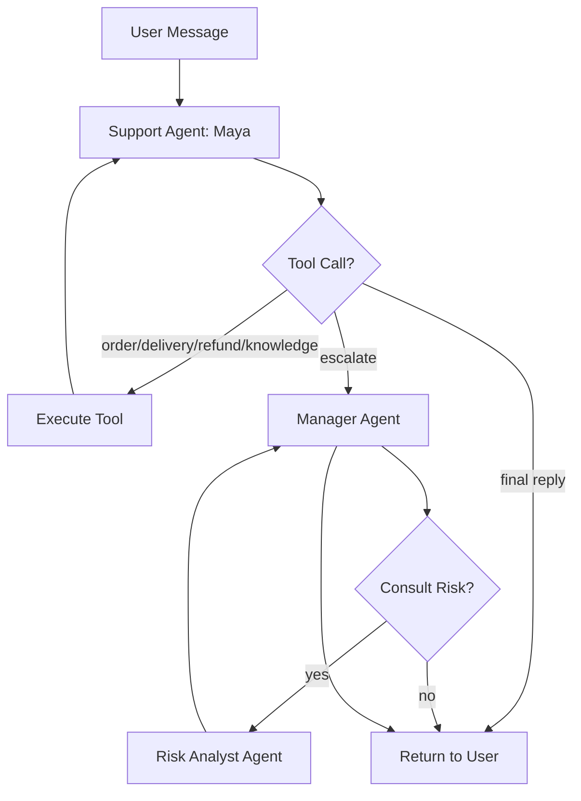

# 🧊 AI Employees — Product Requirements Document (PRD)

**Project:** CoolBreeze AC Multi-Agent Customer Support System  
**Version:** 1.0  
**Date:** 2026-07-25  
**Status:** In Development  

---

## 1. Executive Summary

AI Employees is an intelligent customer support platform for **CoolBreeze AC**, powered by **DeepSeek V4 Pro** and **LangChain/LangGraph**. Three AI agents — Support Agent, Manager Agent, and Risk Analyst — collaborate autonomously to handle customer queries, check order statuses, make refund decisions, and detect fraud patterns.

---

## 2. Problem Statement

### 2.1 Current Pain Points
- Manual customer support is slow and inconsistent
- Refund decisions lack standardized risk assessment
- Customer service reps spend excessive time on repetitive order/delivery lookups
- No real-time visibility into agent decision-making for staff supervision
- Company policy documents (refund, warranty, FAQ) are not easily accessible during conversations

### 2.2 Target Users
| Persona | Needs |
|---------|-------|
| **Customers** | Check order status, request refunds, ask policy questions |
| **Support Staff / Admins** | Monitor AI agent conversations in real-time, override decisions |
| **Business Owners** | Reduce support costs, ensure consistent refund policies, detect fraud |

---

## 3. Goals & Success Metrics

### 3.1 Goals
- **G1:** Automate 80%+ of tier-1 customer support queries
- **G2:** Reduce average refund decision time from hours to seconds
- **G3:** Detect suspicious refund patterns via automated risk analysis
- **G4:** Provide real-time transparency into AI decision-making

### 3.2 Key Metrics (KPIs)
| Metric | Target |
|--------|--------|
| First-response time | < 3 seconds |
| Resolution rate (no human escalation) | > 75% |
| Refund fraud detection accuracy | > 90% |
| Staff dashboard latency (SSE) | < 1 second event delay |
| System uptime | 99.5% |

---

## 4. Features & Requirements

### 4.1 Core Features

#### F1: Multi-Agent AI Chat
- **Support Agent (Maya)** handles first-line queries
- **Manager Agent** reviews escalated refund cases
- **Risk Analyst Agent** evaluates fraud patterns
- Agents collaborate via structured handoffs (LangGraph)

#### F2: Tool-Augmented Agent Actions
| Tool | Description | Agent |
|------|-------------|-------|
| `get_order_details` | Fetch order status, items, tracking info | Support |
| `check_delivery_status` | Live delivery tracking via carrier | Support |
| `get_refund_history` | Review past refunds for a customer | Support |
| `search_knowledge_base` | Query company docs via ChromaDB RAG | Support |
| `escalate_to_manager` | Handoff refund decisions to Manager | Support |
| `analyze_risk` | Fraud pattern analysis (refund ratio, frequency) | Risk |

#### F3: RAG Knowledge Base
- Ingest PDF documents (refund policy, warranty, FAQs)
- Store embeddings in ChromaDB
- Retrieve relevant chunks for grounded responses

#### F4: Real-Time Staff Dashboard
- List all active conversations
- View individual conversation threads
- Server-Sent Events (SSE) streaming of agent tool calls, thoughts, and replies
- Staff-only access (authentication required)

#### F5: Order Management
- Customers view their own orders
- Order detail page with AI chat panel
- Order status tracking and history

#### F6: User Authentication
- Login/logout via Django auth
- Role-based access: Customer vs Staff
- Pre-seeded test users for demos

### 4.2 Non-Functional Requirements

| NFR | Requirement |
|-----|-------------|
| **Performance** | API responses < 500ms; AI responses streamed token-by-token |
| **Security** | CSRF protection, session-based auth, `.env` secrets management |
| **Reliability** | Graceful error handling when LLM API is unavailable |
| **Scalability** | Stateless agent design; horizontal scaling via Gunicorn workers |
| **Maintainability** | Modular Django apps (`orders`, `support`); comprehensive test suite |
| **Observability** | SSE-based real-time event streaming; Django logging |

---

## 5. Architecture Overview

```
┌──────────────┐     ┌─────────────────────────────────────┐
│   Customer   │────▶│  Django Templates (Tailwind CSS)     │
│   Browser    │◀────│  /orders/<id>/  +  AI Chat Widget    │
└──────────────┘     └──────────┬──────────────────────────┘
                                │ POST /support/chat/<id>/
                                ▼
┌──────────────────────────────────────────────────────────┐
│                    Support App (Django)                    │
│  ┌──────────────┐  ┌──────────────┐  ┌────────────────┐  │
│  │ LangChain     │  │ Event Queue  │  │ ChromaDB RAG   │  │
│  │ LangGraph     │  │ (pub/sub)    │  │ (embeddings)   │  │
│  └──────┬───────┘  └──────┬───────┘  └───────┬────────┘  │
│         │                 │                   │           │
│  ┌──────┴─────────────────┴───────────────────┴────────┐  │
│  │              Tool Implementations                    │  │
│  │  order_lookup │ delivery_check │ refund_history      │  │
│  │  knowledge_search │ escalate │ risk_analysis         │  │
│  └─────────────────────────────────────────────────────┘  │
└──────────┬───────────────────────────────────────────────┘
           │
           ▼
┌──────────────────────┐    ┌──────────────────────┐
│   DeepSeek V4 Pro    │    │   MySQL 8.0 Database  │
│   (OpenAI-compat)    │    │   Orders, Users,      │
│   api.deepseek.com   │    │   Messages, Refunds   │
└──────────────────────┘    └──────────────────────┘

┌──────────────────────────────────────────────────────────┐
│                  Staff Dashboard                           │
│  GET /support/dashboard/                                  │
│  GET /support/dashboard/stream/<id>/  ◀── SSE Stream      │
└──────────────────────────────────────────────────────────┘
```

---

## 6. Agent Workflow (LangGraph)



---

## 7. Data Model (Key Entities)

| Entity | Key Fields |
|--------|-----------|
| **User** | username, password, is_staff, email |
| **Product** | name, category, price, stock |
| **Order** | user (FK), product (FK), status, quantity, created_at, tracking_number |
| **RefundRequest** | order (FK), user (FK), status, reason, amount, created_at |
| **Message** | conversation (FK), role, content, created_at |
| **Conversation** | user (FK), order (FK), status, created_at |

---

## 8. API Endpoints

| Method | Endpoint | Auth | Description |
|--------|----------|------|-------------|
| GET | `/login/` | Public | Login page |
| POST | `/login/` | Public | Authenticate user |
| GET | `/orders/` | Login | List user's orders |
| GET | `/orders/<id>/` | Login | Order detail + AI chat |
| POST | `/support/chat/<id>/` | Login | Send message to AI agent |
| GET | `/support/dashboard/` | Staff | Admin dashboard |
| GET | `/support/dashboard/<id>/` | Staff | Conversation detail |
| GET | `/support/dashboard/stream/<id>/` | Staff | SSE real-time event stream |

---

## 9. Tech Stack

| Layer | Technology | Justification |
|-------|-----------|---------------|
| **Backend** | Django 6.0, Python 3.12 | Mature, secure, batteries-included |
| **AI / LLM** | DeepSeek V4 Pro | Cost-effective, OpenAI-compatible API |
| **Agent Framework** | LangChain + LangGraph | Structured agent orchestration, checkpoints, middleware |
| **RAG** | ChromaDB + pypdf | Lightweight, local vector DB for document search |
| **Real-time** | SSE via queue.Queue | Simple, Django-native, no WebSocket overhead |
| **Database** | MySQL 8.0 + PyMySQL | Reliable, widely supported |
| **Frontend** | Django Templates + inline CSS | No SPA overhead; fast development |
| **Deployment** | Railway + Gunicorn + WhiteNoise | Simple, scalable, handles static files |

---

## 10. Test Strategy

### 10.1 Test Levels
| Level | Tool | Coverage |
|-------|------|----------|
| **Unit Tests** | pytest + pytest-django | Models, tools, agents, event queue |
| **Integration Tests** | pytest + Django test client | Views, API endpoints, agent orchestration |
| **Load Testing** | Locust | Stress test AI chat endpoint |
| **Smoke Tests** | pytest | Critical path verification |

### 10.2 Test Users
| Username | Role | Purpose |
|----------|------|---------|
| `admin` | Superuser | Staff dashboard access |
| `sheila` | Customer | Normal usage (5 orders) |
| `dewa` | Customer | Normal usage (3 orders) |
| `noah` | Customer | Normal usage (2 orders) |
| `kangen` | Customer | Fraud detection testing (high refund ratio) |

---

## 11. Risks & Mitigations

| Risk | Impact | Mitigation |
|------|--------|------------|
| LLM API downtime | Critical | Graceful error messages; retry logic |
| Hallucinated refund decisions | High | RAG grounding; human-in-the-loop for large refunds |
| SSE connection drops | Medium | Auto-reconnect on client side |
| Database connection pool exhaustion | Medium | Connection pooling via Gunicorn settings |
| Prompt injection attacks | High | Input sanitization; role-based access control |

---

## 12. Future Roadmap

- [ ] **Multi-language support** — i18n for non-English customers
- [ ] **Voice interface** — STT/TTS integration for phone support
- [ ] **Slack/Teams integration** — AI agent available in messaging platforms
- [ ] **Analytics dashboard** — Conversation metrics, agent performance stats
- [ ] **Fine-tuned models** — Custom-trained on CoolBreeze support transcripts
- [ ] **Automated refund processing** — Full automation for low-risk refunds (<$50)
- [ ] **Email notifications** — Refund status updates via email

---

## 13. Definitions & Acronyms

| Term | Definition |
|------|-----------|
| **RAG** | Retrieval-Augmented Generation — grounding LLM responses in company docs |
| **SSE** | Server-Sent Events — unidirectional real-time data stream |
| **LangGraph** | LangChain's stateful agent orchestration framework |
| **ChromaDB** | Open-source vector database for embedding storage and similarity search |

---

*This PRD is a living document. Submit changes via pull request to `PRDs/PRD.md`.*
