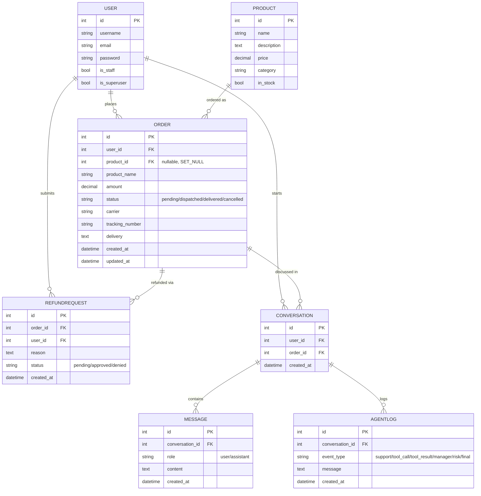
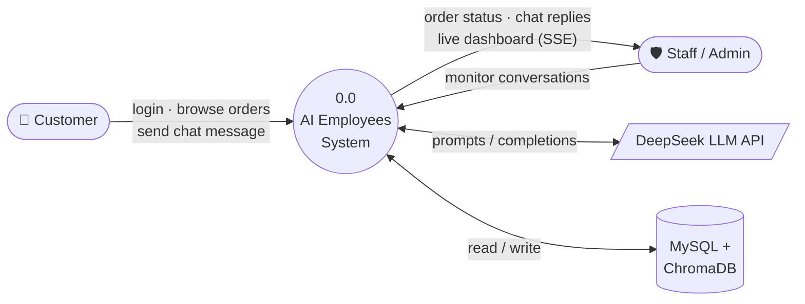
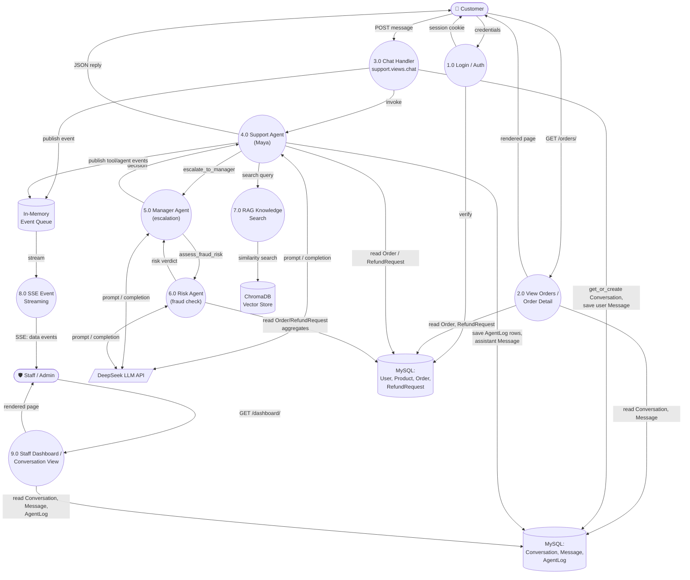
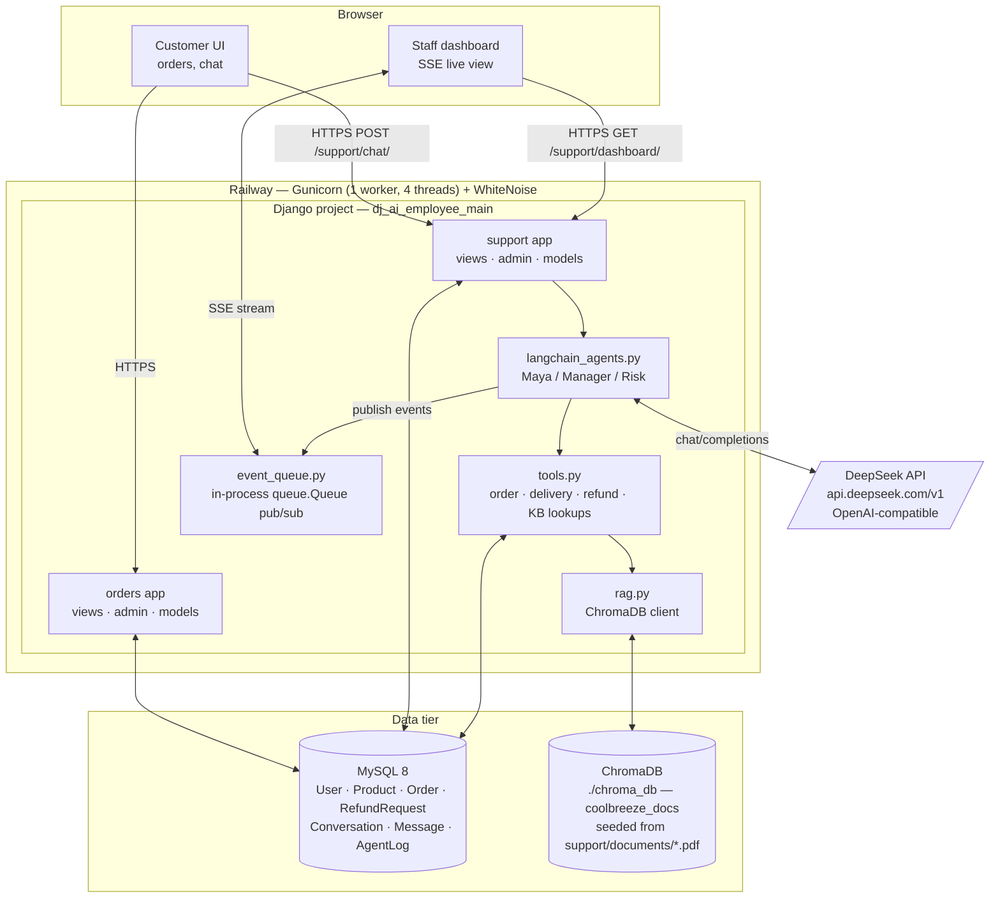

# 🧊 AI Employees — Multi-Agent Customer Support System

An intelligent customer support platform for **CoolBreeze AC**, powered by **DeepSeek V4 Pro** and **LangChain/LangGraph**. Three AI agents — Support Agent, Manager Agent, and Risk Analyst — collaborate autonomously to handle customer queries, check order statuses, and make refund decisions.

---

## 🏗 Architecture

```
User Chat → Support Agent (Maya) → Tools (orders, deliveries, knowledge base)
                    ↓ escalate
            Manager Agent → Risk Agent (fraud analysis)
                    ↓
              Refund Decision
```

### Agent Roles

| Agent | Role | Capabilities |
|-------|------|--------------|
| **Maya** (Support) | First-line customer support | Checks orders, delivery status, refund history, searches company docs |
| **Manager** | Refund decision authority | Reviews escalated cases, consults risk team, approves/denies refunds |
| **Risk Analyst** | Fraud detection | Analyzes customer order & refund patterns, returns risk verdict |

### Live Dashboard

A staff-only dashboard shows real-time agent activity via **Server-Sent Events (SSE)**, streaming tool calls, agent decisions, and final replies as they happen.

---

## 🗄 Data Model (ER Diagram)

Two apps (`orders`, `support`) share Django's built-in `User` model. No M2M/O2O fields — every relationship is a one-to-many foreign key.



---

## 🧭 Status & Enum Glossary

| Field | Values |
|-------|--------|
| `Order.status` | `pending` · `dispatched` · `delivered` · `cancelled` |
| `RefundRequest.status` | `pending` · `approved` · `denied` |
| `Message.role` | `user` · `assistant` |
| `AgentLog.event_type` | `support` · `tool_call` · `tool_result` · `manager` · `risk` · `final` |

---

## 🔄 Data Flow Diagram (DFD)

### Level 0 — Context Diagram

The whole system as one process, its two human actors, and the one external service it depends on.



### Level 1

View of how a chat message moves through auth, storage, the three-agent chain, RAG, and the live SSE dashboard.



---

## 🔀 Sequence Diagram — Chat & Escalation

```mermaid
sequenceDiagram
    actor C as Customer
    participant V as chat view
    participant Maya as Support Agent
    participant Mgr as Manager Agent
    participant Risk as Risk Agent
    participant LLM as DeepSeek API
    participant DB as MySQL
    participant RAG as ChromaDB
    participant Q as Event Queue

    C->>V: POST /support/chat/<id>/ {message}
    V->>DB: get_or_create Conversation, save user Message
    V->>Q: publish("user_message")
    V->>Maya: run_support_agent_langchain()

    Maya->>LLM: prompt + tool schema
    LLM-->>Maya: tool_call(get_order_details / search_knowledge_base)
    Maya->>DB: read Order / RefundRequest
    Maya->>RAG: similarity search
    RAG-->>Maya: relevant chunks
    Maya->>Q: publish("tool_call" / "tool_result")

    opt Maya escalates the case
        Maya->>Mgr: escalate_to_manager()
        Mgr->>LLM: prompt (refund decision)
        Mgr->>Q: publish("manager")
        opt Manager needs a fraud check
            Mgr->>Risk: assess_fraud_risk()
            Risk->>DB: read Order/RefundRequest aggregates
            Risk->>LLM: prompt (risk scoring)
            LLM-->>Risk: risk verdict
            Risk->>Q: publish("risk")
            Risk-->>Mgr: verdict
        end
        Mgr-->>Maya: approve / deny decision
    end

    LLM-->>Maya: final reply text
    Maya->>DB: save AgentLog rows + assistant Message
    Maya->>Q: publish("final")
    Maya-->>V: reply
    V-->>C: 200 JSON {reply}
    Q-->>C: (staff only) SSE stream to live dashboard
```

One `POST /support/chat/<order_id>/` call, traced through Maya's tool calls and the conditional manager → risk escalation. Both branches only fire when Maya (or the Manager) decides they're needed — most messages never leave the first lane.



---

## 🧩 Component / Deployment Diagram

One Gunicorn process on Railway, one MySQL instance, one ChromaDB directory on local disk, one outbound dependency on DeepSeek. Nothing here is horizontally scaled — the in-memory event queue is the reason the Procfile stays at a single worker.



---

## 🛠 Tech Stack

| Layer | Technology |
|-------|-----------|
| **Backend** | Django 6.0, Python 3.12 |
| **AI / LLM** | DeepSeek V4 Pro (OpenAI-compatible API) |
| **Agent Framework** | LangChain + LangGraph (tool calling, checkpoints, middleware) |
| **RAG / Knowledge Base** | ChromaDB + PDF ingestion (`pypdf`) |
| **Real-time Streaming** | Server-Sent Events (SSE) via `queue.Queue` pub/sub |
| **Database** | MySQL 8.0 + PyMySQL |
| **Frontend** | Django Templates (Tailwind-style inline CSS) |
| **Deployment** | Railway (Gunicorn + WhiteNoise) |

---

## 📦 Project Structure

```
django_ai_employees/
├── dj_ai_employee_main/     # Django project settings, URLs, WSGI
├── orders/                  # Orders app — Product, Order, RefundRequest models
├── support/                 # Support app — agents, tools, RAG, event queue
│   ├── agents.py            # DeepSeek SDK agent loops (support/manager/risk)
│   ├── langchain_agents.py  # LangChain/LangGraph agent orchestration
│   ├── tools.py             # Tool implementations (order lookup, delivery, etc.)
│   ├── rag.py               # ChromaDB RAG for company document search
│   ├── event_queue.py       # In-memory pub/sub for SSE streaming
│   └── documents/           # PDFs for RAG (refund policy, warranty, FAQs)
├── templates/               # Django templates (orders, support chat, dashboard)
├── static/                  # Static assets (WhiteNoise)
├── data.json                # Seed fixture (products, orders, users, refunds)
├── requirements.txt         # Python dependencies
├── Procfile                 # Railway deployment
└── manage.py                # Django management
```

---

## 🚀 Quick Start

### Prerequisites

- Python 3.12+
- MySQL 8.0+
- DeepSeek API key ([platform.deepseek.com](https://platform.deepseek.com))

### Setup

```bash
# Clone the repo
git clone https://github.com/mwyzer/django_ai_employees.git
cd django_ai_employee

# Create virtual environment
python -m venv env
source env/Scripts/activate   # Windows
# source env/bin/activate     # macOS/Linux

# Install dependencies
pip install -r requirements.txt
```

### Configuration

Create a `.env` file in the project root:

```env
SECRET_KEY=django-insecure-your-secret-key
DEBUG=True
ALLOWED_HOSTS=localhost,127.0.0.1

DB_NAME=ai_employees
DB_USER=root
DB_PASSWORD=your-mysql-password
DB_HOST=localhost
DB_PORT=3306

DEEPSEEK_API_KEY=sk-your-deepseek-api-key
DEEPSEEK_MODEL=deepseek-chat
```

### Database & Seed Data

```bash
# Create MySQL database
mysql -u root -p -e "CREATE DATABASE IF NOT EXISTS ai_employees CHARACTER SET utf8mb4;"

# Run migrations
python manage.py migrate

# Load seed data (products, orders, users, refunds, conversations)
python manage.py loaddata data.json
```

### Run

```bash
python manage.py runserver
```

Open http://127.0.0.1:8000/login/

---

## 👥 Test Users

| Username | Password | Role |
|----------|----------|------|
| `admin` | `admin123` | Superuser (staff dashboard access) |
| `rathan` | `rathan123` | Customer |
| `priya` | `priya123` | Customer |
| `arjun` | `arjun123` | Customer |
| `fraud_test` | `fraud123` | Customer (high refund ratio — for fraud testing) |

---

## 🔍 How It Works

1. **User logs in** → sees their orders on the orders page
2. **Clicks an order** → opens the AI chat interface
3. **Types a message** → Support Agent (Maya) responds using tools:
   - `get_order_details` — fetches order status and tracking info
   - `check_delivery_status` — checks live tracking via carrier
   - `get_refund_history` — reviews past refunds
   - `search_knowledge_base` — queries company docs via ChromaDB RAG
   - `escalate_to_manager` — escalates complex refund decisions
4. **Manager Agent** reviews the case and can consult the **Risk Agent**
5. **Risk Agent** analyzes fraud patterns (refund-to-order ratio, recent activity)
6. **Final reply** is delivered to the user in the chat interface
7. **Staff dashboard** at `/support/dashboard/` shows all conversations with real-time streaming

---

## 🧪 API Endpoints

| Endpoint | Auth | Description |
|----------|------|-------------|
| `GET /login/` | Public | Login page |
| `POST /login/` | Public | Authenticate |
| `GET /orders/` | Login required | User's orders list |
| `GET /orders/<id>/` | Login required | Order detail + AI chat |
| `POST /support/chat/<id>/` | Login required | Send message to AI agent |
| `GET /support/dashboard/` | Staff only | Admin dashboard |
| `GET /support/dashboard/<id>/` | Staff only | Conversation detail |
| `GET /support/dashboard/stream/<id>/` | Staff only | SSE real-time stream |

---

## 🧠 AI Implementation Details

Two implementations are available:

| Approach | File | Use Case |
|----------|------|----------|
| **LangChain/LangGraph** | `support/langchain_agents.py` | Currently active — full agent orchestration with checkpoints and middleware |
| **Raw OpenAI SDK** | `support/agents.py` | Direct DeepSeek API calls with custom tool loops |

Both use `https://api.deepseek.com/v1` as the base URL with OpenAI-compatible `chat/completions` endpoint.

### RAG (Retrieval-Augmented Generation)

Company documents (PDFs) are stored in `support/documents/` and indexed by ChromaDB. When a customer asks about refund policies or warranty, the agent retrieves relevant chunks and uses them to ground its response.

Load/reload documents:
```python
python manage.py shell
>>> from support.rag import load_documents
>>> load_documents()
```

---

## 🚢 Deployment (Railway)

The app is configured for Railway deployment via `Procfile`:

```
web: gunicorn dj_ai_employee_main.wsgi --bind 0.0.0.0:$PORT --workers 1 --threads 4 --timeout 300
```

Static files are served via **WhiteNoise**. Set all environment variables from `.env` in Railway's dashboard.

---

## 🧪 Test Results

**Status: ✅ All 103 tests passing | 90% coverage**

Last run: 2026-08-07 | Django 6.0.5 | Python 3.12.10 | pytest 9.1.1

### Test Suite Breakdown

| Test File | Tests | Status |
|-----------|-------|--------|
| `tests/test_agents.py` | 15 | ✅ All passing |
| `tests/test_agent_loops.py` | 10 | ✅ All passing |
| `tests/test_langchain_agents.py` | 6 | ✅ All passing |
| `tests/test_rag.py` | 8 | ✅ All passing |
| `tests/test_models.py` | 16 | ✅ All passing |
| `tests/test_tools.py` | 11 | ✅ All passing |
| `tests/test_views.py` | 13 | ✅ All passing |
| `tests/test_event_queue.py` | 8 | ✅ All passing |
| `tests/test_smoke.py` | 16 | ✅ All passing |

### Coverage by Module

| Module | Coverage | Details |
|--------|----------|---------|
| `orders/models.py` | 100% | Product, Order, RefundRequest |
| `orders/admin.py` | 100% | Admin registrations |
| `orders/urls.py` | 100% | URL routing |
| `orders/views.py` | 35% | 7/20 — view functions untested |
| `support/models.py` | 100% | Conversation, Message, AgentLog |
| `support/tools.py` | 100% | All 5 tool implementations |
| `support/event_queue.py` | 100% | Pub/sub event system |
| `support/agents.py` | 100% | Raw SDK agent loops fully covered, incl. manager/risk escalation chain |
| `support/rag.py` | 100% | Chunking, PDF loading, ChromaDB search all covered |
| `support/views.py` | 88% | 41/49 — SSE hanging edge cases |
| `support/langchain_tools.py` | 71% | 12/17 — error paths uncovered |
| `support/langchain_agents.py` | 71% | 61/86 — inner `@tool`/middleware closures uncovered (only reachable via a real LangGraph tool-call loop) |

### Running Tests

```bash
# Full suite with coverage
pytest

# Specific test file
pytest tests/test_agents.py -v

# Without coverage (faster)
pytest --no-cov
```

---

## 📊 Progress Report

### ✅ Completed

| Feature | Status | Notes |
|---------|--------|-------|
| Multi-agent AI system | ✅ | Support, Manager, Risk agents via LangChain/LangGraph |
| Tool calling (5 tools) | ✅ | Order lookup, delivery check, refund history, knowledge base, escalation |
| RAG knowledge base | ✅ | ChromaDB with PDF ingestion (refund policy, warranty, FAQs) |
| Real-time SSE streaming | ✅ | Pub/sub event queue + Server-Sent Events dashboard |
| Staff dashboard | ✅ | Conversation list, detail view, live agent activity |
| User authentication | ✅ | Login/logout, user-scoped orders and chat |
| Seed data | ✅ | `data.json` with 5 users, products, orders, refunds |
| Test suite (103 tests) | ✅ | Models, tools, views, event queue, smoke, agent loops, RAG |
| Railway deployment | ✅ | Gunicorn + WhiteNoise via Procfile |
| Django 6.0 compatibility fix | ✅ | `@login_required` on chat view (SimpleLazyObject FK issue) |
| Coverage: agents.py (26% → 100%) | ✅ | Mocked DeepSeek client boundary; covers all 3 loops + escalation chain + dispatcher |
| Coverage: rag.py (23% → 100%) | ✅ | Mocked ChromaDB collection methods; chunking, PDF loading, search all covered |
| Coverage: langchain_agents.py (29% → 71%) | ✅ | Mocked `create_agent`; outer control flow covered — inner tool/middleware closures remain untested (need a real LangGraph tool-call loop to reach) |
| CI/CD pipeline | ✅ | GitHub Actions (`.github/workflows/tests.yml`) runs the suite on push/PR to `main` |

### 🚧 In Progress / Needs Work

| Area | Priority | Effort | Notes |
|------|----------|--------|-------|
| **Coverage: orders/views.py (35%)** | Medium | Small | Add view tests for order list & detail pages |
| **Coverage: langchain_tools.py (71%)** | Low | Small | Cover error/edge-case paths |
| **Coverage: langchain_agents.py inner closures (71%)** | Low | Medium | Requires driving a real LangGraph tool-call loop or deeper mocking to reach `@tool`/`@wrap_tool_call` bodies |
| **Coverage threshold in CI** | Low | Small | Decide on a `fail_under` floor once the new baseline (90%) has settled |
| **End-to-end tests** | Medium | Large | Playwright/Selenium for browser-level testing |
| **Rate limiting** | Low | Small | Protect AI chat endpoint from abuse |
| **Conversation history persistence** | Low | Small | Paginate long conversation histories |

---

## ⚡ Stress Testing (Locust)

**Status: ✅ 57 requests, 0 failures | 10 users, 30s run**

Last run: 2026-07-24 | Locust 2.46.1

### Latest Results (10 users, 2 spawn/s, 30s)

| Endpoint | Reqs | Avg | Med | p95 | Max |
|----------|------|-----|-----|-----|-----|
| `GET /login/` | 16 | 66ms | 12ms | 370ms | 370ms |
| `GET /admin/login/` | 9 | 169ms | 22ms | 820ms | 820ms |
| `GET /support/dashboard/` | 8 | 50ms | 47ms | 92ms | 92ms |
| `GET /support/dashboard/1/` | 4 | 90ms | 91ms | 150ms | 150ms |
| `POST /support/chat/1/` | 15 | 1.8s | 1.3s | 5.8s | 5.8s |
| `POST /login/` | 5 | 6.9s | 7.1s | 8.0s | 8.0s |
| **Aggregated** | **57** | **1.1s** | **110ms** | **7.1s** | **8.0s** |

### Key Findings

- **Static/dashboard pages**: Fast, all under 100ms median
- **Chat endpoint**: ~1.8s average — dominated by AI API call latency, no server bottleneck
- **Login POST**: ~6.9s average — Django's default PBKDF2 password hashing is CPU-intensive under concurrent users; consider switching to bcrypt with fewer rounds or using cached sessions for repeated test users
- **Zero failures**: No 5xx errors or timeouts under 10 concurrent users

### How to Run

```bash
# Terminal 1: Start the server
python manage.py runserver

# Terminal 2: Run Locust (web UI at http://localhost:8089)
locust -f locustfile.py --host=http://127.0.0.1:8000

# Or headless mode (automated):
locust -f locustfile.py --host=http://127.0.0.1:8000 --headless -u 50 -r 5 --run-time 60s

# Generate HTML report:
locust -f locustfile.py --host=http://127.0.0.1:8000 --headless -u 10 -r 2 --run-time 30s --html=stress_report.html
```

### Test Scenarios (`locustfile.py`)

| User Class | Weight | Simulates |
|------------|--------|-----------|
| `AIEmployeeUser` | — | Full login → dashboard → conversation → chat message flow |
| `SmokeCheckUser` | — | Lightweight health checks (login page, admin page) |

The chat test sends a realistic customer message (`"Where is my order?"`) and verifies the AI agent responds without 5xx errors. SSE streaming tests connect to the real-time event endpoint and validate data flow.

---

## 📄 License

MIT
